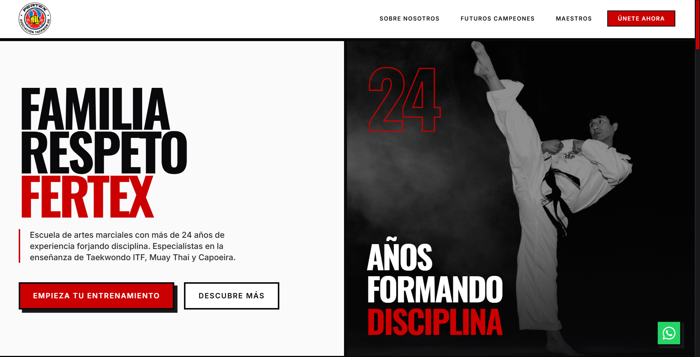

# FERTEX | Academia de Artes Marciales

Sitio web oficial de FERTEX, escuela de artes marciales con más de 24 años de experiencia en San Juan de Lurigancho. Especializados en Taekwondo ITF, Muay Thai y Capoeira.


> **Nota para ti:** Para que la imagen de arriba aparezca en tu repositorio de GitHub, solo tienes que tomar una captura de pantalla de tu página web, nombrarla exactamente `preview.png` y guardarla dentro de la carpeta `public/` de este proyecto.

## 🚀 Tecnologías (Tech Stack)

Este proyecto fue construido con un enfoque en rendimiento extremo, SEO y un diseño brutalista moderno:

- **Framework:** [React](https://react.dev/) + [Vite](https://vitejs.dev/)
- **Estilos:** [Tailwind CSS](https://tailwindcss.com/)
- **Animaciones:** [Framer Motion](https://www.framer.com/motion/)
- **Scroll Suave:** [Lenis](https://lenis.studiofreight.com/)
- **Despliegue:** [Vercel](https://vercel.com/)

## ✨ Características Principales

- **Diseño Brutalista:** Alto contraste, tipografía masiva (Oswald/Inter) y uso de sombras pronunciadas para una estética ruda y moderna.
- **Rendimiento Optimizado:** Carga casi instantánea, precarga de archivos y animaciones fluidas (60fps).
- **Micro-interacciones:** Botones con efectos hover mecánicos, animaciones de entrada sincronizadas y un preloader personalizado.
- **SEO Técnico Avanzado:** `sitemap.xml`, `robots.txt`, etiquetas Open Graph para redes sociales y datos estructurados (JSON-LD) para dominar la búsqueda de Google.

## 🛠️ Desarrollo Local

Para correr este proyecto en tu propia computadora, sigue estos pasos:

1. **Clonar el repositorio:**
   ```bash
   git clone https://github.com/jhefferson-guerrero/fertex-web.git
   cd fertex-web
   ```

2. **Instalar dependencias:**
   ```bash
   npm install
   ```

3. **Iniciar el servidor de desarrollo:**
   ```bash
   npm run dev
   ```
   *El servidor se abrirá normalmente en `http://localhost:5173`.*

## 📦 Despliegue (Producción)

El proyecto está configurado para despliegue continuo a través de **Vercel**. 
Cualquier cambio subido (push) a la rama principal (`main`) en GitHub activará una actualización automática en la web oficial:

👉 **[https://www.taekwondofertex.com](https://www.taekwondofertex.com)**

Para probar la versión de producción en local:
```bash
npm run build
npm run preview
```

---
*Desarrollado con mentalidad de alto rendimiento.*
